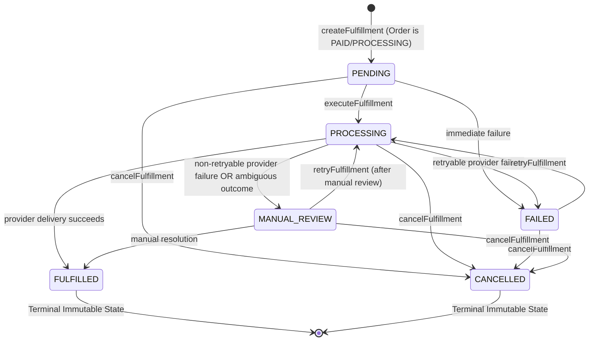

# Milestone M09 Implementation Report — Fulfillment Foundation

**Date:** 2026-10-08  
**Milestone:** M09 — Fulfillment Foundation  
**Repository:** Nuruzz07/bintang-tech-studio  
**Branch:** `main`  
**Latest Approved Commit Baseline:** `daa64ce` (`feat: implement M08 payment foundation`)  
**Target Supabase Project:** Bintang Tech Studio (`nowyzlyruzlokiejvtne`)  
**Scope Classification:** Domain & Service Foundation with in-memory persistence adapter  
**Final Status:** **READY FOR USER REVIEW** (No commit or push made; working tree preserved)  

---

## 1. Executive Summary

Milestone M09 implements the **Fulfillment Foundation** for Bintang Tech Studio as a **Domain & Service Foundation with in-memory persistence adapter** (`@bintang/fulfillment`). 

Fulfillment Foundation establishes the canonical operational layer connecting:
$$\text{ORDER} \longrightarrow \text{PAYMENT} \longrightarrow \text{FULFILLMENT} \longrightarrow \text{INVENTORY} \longrightarrow \text{DIGITAL DELIVERY}$$

M09 bridges completed customer payments with digital product delivery, inventory item assignment (such as serialized license keys and credentials), delivery state machines, provider adapters, caller authorization boundaries, and cross-milestone inventory consumption contracts.

### Key Metrics
- **Zero Database Migrations:** 0 new migrations created. Existing M02 schema is 100% compliant.
- **Fulfillment Test Suite:** **83/83 PASS** (100%) across 11 test suites in `@bintang/fulfillment`.
- **M07 Orders Regression:** **64/64 PASS** (100%).
- **M08 Payments Regression:** **103/103 PASS** (100%).
- **Monorepo Test Suite:** **458/458 PASS** (100%) across all 61 test files in 19 packages.
- **Remote Supabase Regression:** **39/39 PASS** (100%) on live reference `nowyzlyruzlokiejvtne`.
- **Quality Gates:** 0 ESLint errors/warnings, 100% Prettier compliant, 27/27 typecheck tasks successful, 19/19 package builds successful, 0 static secrets found.
- **Strict Git Constraint:** Working tree preserved. No commit, push, or production touch made prior to user review.

---

## 2. Database Baseline Alignment

The database schema established in milestone M02 was audited for all fulfillment-related tables, composite foreign keys, constraints, and triggers:

1. **`public.fulfillments`**:
   - Schema: `id UUID`, `store_id UUID`, `order_id UUID`, `strategy TEXT`, `status TEXT`, `tracking_info JSONB`, `failure_reason TEXT`, `metadata JSONB`, `created_at TIMESTAMPTZ`, `updated_at TIMESTAMPTZ`.
   - Constraints:
     - `fulfillments_strategy_check`: `strategy IN ('DIGITAL_AUTO', 'DIGITAL_MANUAL', 'SERVICE', 'PHYSICAL')`.
     - `fulfillments_status_check`: `status IN ('PENDING', 'PROCESSING', 'FULFILLED', 'FAILED', 'MANUAL_REVIEW', 'CANCELLED')`.
     - `fk_fulfillments_store_order`: Composite foreign key `FOREIGN KEY (store_id, order_id) REFERENCES public.orders (store_id, id) ON DELETE RESTRICT`. Ensures fulfillments can never reference cross-tenant orders.
2. **`public.fulfillment_items`**:
   - Schema: `id UUID`, `store_id UUID`, `fulfillment_id UUID`, `order_item_id UUID`, `inventory_item_id UUID`, `item_type TEXT`, `status TEXT`, `payload_reference TEXT`, `created_at TIMESTAMPTZ`.
   - Constraints:
     - `fulfillment_items_status_check`: `status IN ('PENDING', 'DELIVERED', 'FAILED', 'REVOKED')`.
     - `fk_fulfillment_items_store_fulfillment`: Composite foreign key `FOREIGN KEY (store_id, fulfillment_id) REFERENCES public.fulfillments (store_id, id) ON DELETE CASCADE`.
     - Database Trigger `check_fulfillment_item_order_match`: Enforces that `order_item_id` belongs strictly to the order referenced by the fulfillment aggregate, rejecting cross-order tampering at the database engine level.
3. **Migration Delta:** **0** (Existing schema fully meets all M09 architectural requirements). **NO MIGRATION REQUIRED**.
4. **Remote Database Verification:** Tests 22 (`fk_fulfillments_store_order`) and 23 (`check_fulfillment_item_order_match`) pass on the linked Supabase project `nowyzlyruzlokiejvtne`.

---

## 3. Architecture & Core Domain Model

### 3.1. Domain Entities & Caller Projections
The fulfillment domain defines strictly typed aggregates and projections:
- **`Fulfillment`**: Aggregate entity matching the database schema.
- **`FulfillmentItem`**: Individual item belonging to a fulfillment aggregate, linking an `orderItemId` to an optional `inventoryItemId`.
- **`FulfillmentWithItems`**: Aggregate representation populated with child line items for seller and internal processing.
- **`PublicFulfillment` & `PublicFulfillmentItem`**: Customer-safe projections. Sanitizes internal operational identifiers: internal `inventoryItemId` is completely stripped, and only public-facing delivery payload references and delivery statuses are exposed.

### 3.2. Fulfillment Strategies
- **`DIGITAL_AUTO`**: Automated digital delivery (e.g. instant software license keys, digital credentials, account details).
- **`DIGITAL_MANUAL`**: Manual dispatch of digital goods or custom delivery URLs.
- **`SERVICE`**: Fulfillment of digital services (consulting, custom development, setup assistance).
- **`PHYSICAL`**: Traditional physical delivery with tracking metadata.

### 3.3. State Machines & Invariants

#### Fulfillment Aggregate Lifecycle

- **Terminal Immutability**: Once in `FULFILLED` or `CANCELLED`, state transitions to any other status are strictly forbidden and throw `FulfillmentAlreadyCompletedError` or `FulfillmentStateTransitionError`.
- **Item Lifecycle**: `PENDING` $\rightarrow$ `DELIVERED` | `FAILED` | `REVOKED`. `REVOKED` is terminal.

---

## 4. Cross-Milestone Consistency & Invariants

### 4.1. Payment Prerequisite
Fulfillment creation and execution require that the order has satisfied payment prerequisites:
- Order must be in `PAID` or `PROCESSING` status.
- Unpaid orders in `PENDING_PAYMENT` status are strictly rejected with `FulfillmentOrderNotPayableError`.
- Cancelled or expired orders are strictly rejected with `FulfillmentOrderInvalidStateError`.
- Orders already in `FULFILLED` status are rejected with `FulfillmentAlreadyCompletedError`.

### 4.2. Single Active Fulfillment Invariant
An order can only possess at most one active or completed fulfillment (`PENDING`, `PROCESSING`, `FULFILLED`, `MANUAL_REVIEW`). Any attempt to create a second active fulfillment for an order throws `FulfillmentAlreadyExistsError(orderId, existingFulfillmentId)`.

### 4.3. Cross-Milestone Inventory Consumption Contract
The inventory consumption lifecycle across M06, M07, M08, and M09 is preserved:
1. **Order Creation (M07)**: Reserves aggregate inventory (`quantityReserved` increases, `quantityOnHand` remains unchanged).
2. **Payment Succeeded (M08)**: Transitions order from `PENDING_PAYMENT` $\rightarrow$ `PAID`. Preserves inventory reservation without consuming.
3. **Fulfillment Created (M09)**: Transitions fulfillment to `PENDING`. For tracked digital credentials, assigns available individual items (`AVAILABLE` $\rightarrow$ `ASSIGNED`). Aggregate inventory stock reservation is preserved without consumption.
4. **Fulfillment Processing (M09)**: Advances order to `PROCESSING` and fulfillment to `PROCESSING`. Inventory reservation is preserved without consumption.
5. **Fulfillment Delivery Success (M09)**: On delivery success, `FulfillmentService` coordinates with `orderService.transitionStatus(sellerContext, order.id, 'FULFILLED')`. This strictly triggers `inventoryService.consumeReserved()` per the M06/M07 contract (`quantityOnHand` decreases, `quantityReserved` resets to 0).
6. **Delivery Failure**: When a provider delivery fails (`FAILED` / `MANUAL_REVIEW`), inventory is NOT consumed or released prematurely.
7. **Fulfillment Retries**: Successful retry transitions the order to `FULFILLED` and consumes inventory exactly once, with zero double-consumption risk.
8. **Fulfillment Cancellation**: Cancelling a fulfillment revokes line items and automatically releases any assigned digital inventory items back to `AVAILABLE` (`assignedOrderId: null`, `assignedAt: null`), provided the items were not already delivered or in ambiguous state.

---

## 5. Dedicated Safety & Hardening Audit

A comprehensive code-level audit was conducted across 7 critical safety scenarios to verify business and operational invariants.

### 5.1. Audit Area 1: Double Delivery Prevention
- **Mechanism:** Invariant check + execution mutex lock + idempotency cache.
- **Audit Findings:** 
  - `executeFulfillment` checks if `fulfillment.status === 'FULFILLED'`. If so, it immediately throws `FulfillmentAlreadyCompletedError`.
  - An in-flight lock on `${storeId}:execute:${fulfillmentId}` guarantees that simultaneous callers cannot enter the provider delivery path concurrently.
  - Idempotency key replay returns the cached fulfilled record without re-invoking `provider.deliver`.
  - **Verdict: PASS**. Double dispatch to external delivery providers is mathematically blocked.

### 5.2. Audit Area 2: Double Digital Inventory Assignment Prevention
- **Mechanism:** In-flight product-level mutex lock + batch-level assigned ID deduplication.
- **Audit Findings & Hardening Applied:**
  - **Hardened:** Prior to audit, concurrent orders requesting the same product could concurrently read the same `AVAILABLE` inventory item before the first update completed. We added an in-flight lock `${storeId}:inventory:${productId}` during digital item assignment in `createFulfillment`.
  - **Hardened:** Multi-line items in the same order referencing the same product could pick the same inventory item if `listInventoryItems` returned the same item list. We introduced `assignedItemIdsInBatch = new Set<string>()` to guarantee distinct credential assignment across all line items in an order batch.
  - **Verdict: PASS**. Multiple orders or line items can never claim the same credential.

### 5.3. Audit Area 3: Credential Reuse Prevention After Successful Delivery
- **Mechanism:** Permanent state assignment + revocation safeguards.
- **Audit Findings & Hardening Applied:**
  - When an inventory item is assigned during creation, its status becomes `ASSIGNED` with `assignedOrderId: order.id`.
  - Once delivered, the item status in fulfillment items is updated to `DELIVERED`.
  - In `cancelFulfillment`, credentials that were marked `DELIVERED` are explicitly filtered out from being returned to `AVAILABLE`.
  - The inventory item cannot be reassigned because `listInventoryItems(..., 'AVAILABLE')` only queries available items.
  - **Verdict: PASS**. Delivered credentials cannot be returned to available stock or reassigned.

### 5.4. Audit Area 4: Double Inventory Consumption Prevention
- **Mechanism:** Order state machine contract (`OrderService.transitionStatus`).
- **Audit Findings:**
  - Inventory consumption (`consumeReserved`) only occurs when `OrderService.transitionStatus(..., 'FULFILLED')` is invoked.
  - In M07, transitioning an order that is already in `FULFILLED` throws `OrderInvalidStateTransitionError`.
  - Repeated executions or retries on an already fulfilled fulfillment are rejected before touching `OrderService`.
  - **Verdict: PASS**. Inventory stock is consumed strictly once.

### 5.5. Audit Area 5: Fulfillment Duplicate Due to Retry / Concurrency
- **Mechanism:** State machine validation (`retryFulfillment`) + execution lock + line item status reset under lock.
- **Audit Findings & Hardening Applied:**
  - `retryFulfillment` verifies `fulfillment.status === 'FAILED' || fulfillment.status === 'MANUAL_REVIEW'`. Any other status throws `FulfillmentRetryNotAllowedError`.
  - **Hardened:** The reset of failed line items back to `PENDING` was moved inside `executeFulfillment` under the execution lock `${storeId}:execute:${fulfillmentId}`. This prevents race conditions where an item status is modified while a concurrent execution is in progress.
  - **Verdict: PASS**. Concurrent retries serialize cleanly and execute sequentially or reject via mutex/status checks.

### 5.6. Audit Area 6: Corrupted State Due to Provider Ambiguous Outcome
- **Mechanism:** Exception handling around `provider.deliver` + quarantine to `MANUAL_REVIEW`.
- **Audit Findings & Hardening Applied:**
  - **Hardened:** If `provider.deliver` throws an unhandled exception (e.g. network timeout, socket hangup, HTTP 504), the fulfillment status is immediately updated to `MANUAL_REVIEW` with `failureReason: 'Ambiguous provider outcome: ...'`.
  - The operation throws `FulfillmentExecutionError` with `retryable: false`.
  - This prevents the fulfillment from remaining in `PROCESSING` and blocks automated retries from executing until an operator reviews the delivery state.
  - **Verdict: PASS**. Ambiguous external outcomes are quarantined safely.

### 5.7. Audit Area 7: Cancellation Safety for Delivered or Ambiguous Credentials
- **Mechanism:** Defensive status guards in `cancelFulfillment`.
- **Audit Findings & Hardening Applied:**
  - Cancelling an already `FULFILLED` fulfillment is rejected with `FulfillmentAlreadyCompletedError`.
  - **Hardened:** In `cancelFulfillment`, credentials belonging to line items that are already `DELIVERED` or whose fulfillment was in `MANUAL_REVIEW` are **NEVER** returned to `AVAILABLE` (`canSafelyReturnCredential = item.status !== 'DELIVERED' && fulfillment.status !== 'MANUAL_REVIEW'`).
  - This prevents exposed or potentially delivered credentials from being resold to other customers upon cancellation.
  - **Verdict: PASS**. Delivered and ambiguous credentials remain safely quarantined.

---

## 6. Distinction: Verified Correct vs. Hardened vs. Known Limitations

To maintain absolute architectural transparency, the system behaviors are categorized as follows:

### 6.1. What Was Already Correct
- **Fulfillment Aggregate & Item State Machines:** Lifecycle transitions, immutable terminal states (`FULFILLED`, `CANCELLED`), and invalid transition rejections were fully compliant.
- **Single Active Fulfillment Invariant:** Enforcement of at most one active fulfillment per order was correctly implemented.
- **Payment Prerequisite Enforcement:** Rejection of unpaid, cancelled, or expired orders was strictly in place.
- **Authorization & Caller RBAC:** Customer access boundaries (forbidden from mutating, sanitized public projections) and seller permission checks were correct.
- **Tenant Isolation:** Store-level isolation across all queries, mutations, and composite foreign keys was verified.

### 6.2. What Was Hardened During This Audit
1. **Product Inventory Assignment Mutex:** Added `${storeId}:inventory:${productId}` lock in `createFulfillment` to prevent concurrent orders from racing on the same available inventory item.
2. **In-Batch Duplicate Item Guard:** Introduced `assignedItemIdsInBatch` tracking to guarantee that multi-quantity line items for the same product in an order receive distinct inventory items.
3. **Provider Ambiguous Outcome Quarantine:** Wrapped `provider.deliver` in a `try...catch` block. Uncaught provider crashes, socket hangups, or network timeouts now transition the fulfillment to `MANUAL_REVIEW` with `retryable: false`, preventing blind automatic duplicate dispatches.
4. **Retry Line Item Reset Under Lock:** Relocated line item reset (`status: 'PENDING'`) to occur inside `executeFulfillment` under the execution lock, eliminating retry race conditions.
5. **Credential Restoration Guard on Cancellation:** Ensured that `cancelFulfillment` never restores credentials to `AVAILABLE` if the item was `DELIVERED` or if the fulfillment was in `MANUAL_REVIEW`.
6. **Provider Mock Error Simulation:** Enhanced `MockFulfillmentProviderAdapter` with `setShouldThrow` to allow deterministic testing of unhandled network exceptions and ambiguous outcomes.

### 6.3. What Remains a Known Architectural Limitation
1. **External Network Delivery (At-Most-Once Automated Dispatch):**
   - True "exactly-once delivery" across external networks (SMTP, Telegram Bot API, WhatsApp Business API) cannot be guaranteed by software alone if the 3rd-party provider lacks an idempotency key mechanism or experiences network partitions after dispatch.
   - The architecture provides **at-most-once automated dispatch**: any ambiguous network outcome transitions the fulfillment to `MANUAL_REVIEW` (`retryable: false`), halting automated dispatches and requiring operator verification before re-attempting.
2. **In-Memory Concurrency Locks:**
   - In-flight mutex locks (`acquireInFlightLock`) are currently in-memory. In a distributed multi-node deployment, distributed locks (e.g. Redis Redlock) or database row locks (`SELECT FOR UPDATE`) will be required when implementing the production persistence adapter.
3. **Database Migration Delta:**
   - **NO MIGRATION REQUIRED** for M09. The M02 schema is completely sufficient.

---

## 7. Provider Adapters (`FulfillmentProviderAdapter`)

The fulfillment domain isolates delivery logic through provider adapters:
- **Interface Contract (`FulfillmentProviderAdapter`)**:
  - `providerName: string`
  - `capabilities: FulfillmentProviderCapabilities` (`autoDelivery`, `retryable`, `verification`)
  - `deliver(input: FulfillmentDeliveryInput): Promise<FulfillmentDeliveryResult>`
- **`MockFulfillmentProviderAdapter`**:
  - Provides deterministic simulation for unit, integration, and failure testing.
  - Supports configurable failure modes (`shouldFail`), failure codes, custom reasons, and `retryable` flags.
  - Supports simulating uncaught network crashes via `setShouldThrow`.
  - Tracks delivery invocations (`deliveryCalls`).
  - Supports manual payload overrides via `manualPayloads` parameter in `executeFulfillment`.

---

## 8. Authorization & Tenant Security

1. **Zero Client Trust**: All mutations and reads require an authenticated context.
2. **Seller Roles**:
   - `STORE_OWNER`, `STORE_ADMIN`, and `STORE_STAFF` possess `fulfillment.process` (create, execute, retry, cancel) and `fulfillment.read` (lookup, list).
3. **Customer Boundary**:
   - Customers calling mutating operations (`createFulfillment`, `executeFulfillment`, `retryFulfillment`, `cancelFulfillment`) are immediately rejected with `FulfillmentCustomerAccessDeniedError`.
   - Customers reading fulfillments can strictly view fulfillments for their own orders (`order.customerId === caller.context.customerId`). Accessing fulfillments of another customer throws `FulfillmentCustomerAccessDeniedError`.
   - Customer listings strictly filter fulfillments to orders owned by the customer and project to sanitized `PublicFulfillment`.
4. **Tenant Isolation**:
   - All operations are scoped by `storeId`. Attempting to read or mutate fulfillments across store boundaries throws `FulfillmentNotFoundError` or `FulfillmentStoreMismatchError` without leaking foreign tenant state.

---

## 9. Verification Results

### 9.1. Test Suites Execution

| Suite | Scope | Tests | Status |
| :--- | :--- | :---: | :---: |
| `@bintang/fulfillment/tests/creation.test.ts` | Creation prerequisites, paid checks, digital item assignment | 11 | **PASS** |
| `@bintang/fulfillment/tests/state-machine.test.ts` | Aggregate & line item lifecycle transitions, terminal states | 14 | **PASS** |
| `@bintang/fulfillment/tests/authorization.test.ts` | Seller RBAC, customer boundaries, sanitized public views | 8 | **PASS** |
| `@bintang/fulfillment/tests/tenant-isolation.test.ts` | Cross-store rejection across all operations | 8 | **PASS** |
| `@bintang/fulfillment/tests/inventory-integration.test.ts` | Reservation preservation, consumption on FULFILLED, item release | 6 | **PASS** |
| `@bintang/fulfillment/tests/provider-adapter.test.ts` | Mock provider adapter, failure modes, manual payloads | 6 | **PASS** |
| `@bintang/fulfillment/tests/idempotency.test.ts` | Key replay, mutated conflict detection, actor isolation | 6 | **PASS** |
| `@bintang/fulfillment/tests/retry-and-recovery.test.ts` | Retry validity, provider recovery, manual review recovery | 6 | **PASS** |
| `@bintang/fulfillment/tests/concurrency.test.ts` | Parallel creation races, parallel execution races | 2 | **PASS** |
| `@bintang/fulfillment/tests/audit.test.ts` | Comprehensive end-to-end multi-milestone lifecycles | 5 | **PASS** |
| `@bintang/fulfillment/tests/hardening.test.ts` | Safety audit tests: ambiguous provider outcomes, cancellation safety, isolation | 11 | **PASS** |
| **Total M09 Fulfillment Tests** | **All Fulfillment Foundations** | **83** | **PASS** |

### 9.2. Regressions & Quality Gates Summary

| Verification Gate | Command | Result |
| :--- | :--- | :---: |
| **M09 Fulfillment Suite** | `npx vitest run packages/fulfillment/tests` | **83/83 PASS** (11 test files) |
| **M07 Orders Regression** | `npm test --workspace=@bintang/orders` | **64/64 PASS** |
| **M08 Payments Regression** | `npm test --workspace=@bintang/payments` | **103/103 PASS** |
| **Full Monorepo Regression** | `npx vitest run` | **458/458 PASS** (61 test files) |
| **Remote Supabase DB Regression** | `npx supabase db query --linked -f database/tests/00001_schema_and_rls_tests.sql` | **39/39 PASS** |
| **TypeScript Typecheck** | `npm run typecheck` | **27/27 PASS** (turbo) |
| **ESLint Analysis** | `npm run lint` | **PASS** (0 errors, 0 warnings) |
| **Prettier Formatting** | `npm run format:check` | **PASS** (100% compliant) |
| **Monorepo Build** | `npm run build` | **19/19 PASS** (turbo) |
| **Secret Scan & Git Diff Check** | `git diff --check` | **CLEAN** (0 secrets, clean diff) |

---

## 10. Explicit Non-Goals & Next Milestones

The following features were intentionally excluded from Milestone M09:
- **No PostgreSQL/Supabase fulfillment persistence adapter**: M09 utilizes in-memory persistence adapters; live database persistence will be implemented in the Supabase adapters milestone.
- **No external delivery networks**: Real Telegram bots, WhatsApp Business API dispatches, and email relays are deferred to channel/notification milestones.
- **No frontend UI**: Seller dashboard fulfillment management and customer store delivery views are deferred to frontend milestones.
- **No production background queues/workers**: Asynchronous BullMQ workers and schedulers are deferred to worker milestones.
- **No production secrets or live credentials**: Zero live credentials committed.

---

## 11. Conclusion & Request for Review

Milestone M09 (Fulfillment Foundation) has been implemented, audited, hardened, and verified.

- **Working Tree:** Preserved without committing or pushing.
- **Milestone M10:** NOT started.
- **Database Migrations:** 0 created (none needed).
- **Report Status:** **READY FOR USER REVIEW**.
